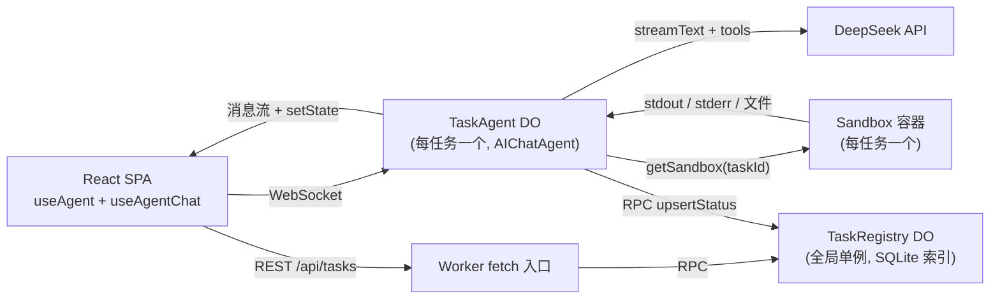

# Cloud Agent

> 单用户的自主式（autonomous）云端编码 Agent —— 用自然语言下发一个任务，Agent 在隔离的 Cloudflare 沙箱中自主「推理 → 调用工具 → 观察结果 → 继续」，全程把每一步实时流式推送到 React 界面，并在结束时给出一份 Markdown 报告。

技术栈：**React 19 + Cloudflare**（Workers / Durable Objects / Containers·Sandbox SDK / Agents SDK）+ **Vercel AI SDK**，LLM 使用 **DeepSeek**（`@ai-sdk/deepseek`）。

---

## 目录

- [整体架构与可扩展性](#整体架构与可扩展性)
- [Agent 编排与调度](#agent-编排与调度)
- [沙箱与隔离执行](#沙箱与隔离执行)
- [LLM 集成与工具调用](#llm-集成与工具调用)
- [快速开始](#快速开始)
- [配置](#配置)
- [部署](#部署)
- [项目结构](#项目结构)
- [TODO](#todo)

---

## 整体架构与可扩展性

整个系统由**一个 Cloudflare Worker** 承载：它同时托管 React 单页应用（静态资源）以及三类 Durable Object（DO）。每个任务都是**完全隔离**的一组资源 —— 一个 `TaskAgent`（自主循环 + 消息持久化）配一个 `Sandbox` 容器（真实的 Linux 执行环境），都以 `taskId` 为键。



**职责划分**

| 组件 | 类型 | 作用 |
| --- | --- | --- |
| Worker `fetch` | 入口 | 处理 `/api/*` REST，其余交给 `routeAgentRequest` 路由到 Agent；托管 SPA 静态资源 |
| `TaskAgent` | 每任务一个 DO（`AIChatAgent`） | 运行自主循环、持久化消息、维护任务状态 |
| `Sandbox` | 每任务一个容器 DO | 隔离的 shell + 文件系统执行环境 |
| `TaskRegistry` | 全局单例 DO | 用 SQLite 索引所有任务（id / title / status / 时间戳），供历史列表查询 |

**可扩展性设计**

- **每任务隔离、无中心数据库瓶颈**：每个任务的消息历史落在各自 `TaskAgent` 的内嵌 SQLite，执行落在各自的 `Sandbox` 容器。`TaskRegistry` 只存轻量元数据索引，不存大输出。
- **写入权清晰**：客户端只能**创建**任务行（`id` + 可选 `title`），任务的 `status`/`title` 之后只由 `TaskAgent` 写入，避免前端把 `done`/`error` 状态写回成旧值。见 `src/server.ts` 中 `TaskRegistry.create` 与 `upsertStatus` 的区分。
- **工具可插拔**：工具集中在 `src/tools/` 下，由 `makeTools(env, sandboxId)` 工厂统一装配（`src/tools/index.ts`）。新增能力只需写一个 `tool({...})` 并注册进工厂。
- **模型可替换**：模型构造集中在 `makeModel(env)`（`src/server.ts`），换成任意 AI SDK provider（OpenAI / Anthropic / 经 AI Gateway 路由的 DeepSeek 等）只需改这一处。
- **前后端解耦**：UI 通过 `useAgent` / `useAgentChat`（WebSocket）消费 Agent，通过 `/api/tasks` REST 消费历史索引，二者互不依赖。

---

## Agent 编排与调度

核心理念：**不手写 Agent 循环**，而是复用 `@cloudflare/ai-chat` 的 `AIChatAgent` —— AI SDK 的 `streamText` 多步工具循环**本身就是** Agent 的「推理-执行」循环。

`TaskAgent`（`src/server.ts`）扩展自 `AIChatAgent`，关键点：

```20:28:src/server.ts
type TaskState = {
  status: "idle" | "running" | "done" | "error";
  title: string;
  sandboxId: string;
  createdAt: string;
  runStartedAt: string;
  runTimings: Record<string, number>;
  error: string | null;
};
```

**调度与循环控制**

- **多步循环**：`onChatMessage` 里调用 `streamText`，由 `stopWhen: stepCountIs(25)` 限定最多 25 步，防止失控的无限循环。
- **自主执行、无人工审批**：系统提示词要求 Agent「inspect → act → observe → repeat」，不向用户提问、自行做合理假设，结束时输出 Markdown 报告（见 `SYSTEM_PROMPT`）。
- **可中断**：`options.abortSignal` 一路透传进 `streamText`，前端点 Stop 即可取消正在进行的 DeepSeek 调用与工具执行。
- **崩溃恢复**：`chatRecovery = true` 让长任务在 Durable Object 被驱逐/休眠后仍能恢复并续跑；`maxPersistedMessages = 100` 控制持久化窗口。

**状态机与广播**

- 状态用 Agent 的 `setState`/`state` 维护（不是手搓 SQL 表），每次变更会通过 WebSocket 广播给所有连接的客户端，前端据此渲染状态徽章（`运行中`/`完成`/`失败` 等，见 `src/lib/task-status.ts`）。
- 状态流转：进入 `onChatMessage` 置 `running` 并上报 `TaskRegistry`；`toUIMessageStreamResponse` 的 `onFinish` 根据是否被中断置 `done`/`idle`，`onError` 置 `error`。每次转换都**先 `setState` 再上报那个确切的状态对象**，并用 `ctx.waitUntil` 守护写入落库。
- **计时**：`onChatResponse` 在每条回复完成时，按 `runStartedAt` 计算本轮耗时写入 `runTimings[messageId]`，前端 `AgentLoopGroup` 据此显示「Worked for …」。

**消息持久化与时间线**

- 完整的 `UIMessage[]`（推理 + 每次工具调用的入参/输出）由 SDK 自动持久化进 `TaskAgent` 的 SQLite，是可断点续传、可刷新重连的权威时间线。
- 工具调用以结构化 message part 的形式存在，前端直接把它们渲染成执行时间线（`src/components/task/`）。

---

## 沙箱与隔离执行

每个任务对应一个独立的 **Cloudflare Sandbox 容器**（`@cloudflare/sandbox`），提供真实的 Linux shell 与文件系统，与 Worker 进程、其它任务彼此隔离。

- **绑定方式**：工具通过 `getSandbox(env.Sandbox, sandboxId)` 拿到当前任务的沙箱句柄，`sandboxId` 即 `taskId`，保证「一任务一容器」。
- **容器镜像**：基于 `cloudflare/sandbox:0.7.0`，额外装了 `git`（便于克隆/分析仓库），见 `Dockerfile`。可按需加更多工具，但应保持精简以降低冷启动成本。
- **资源配置**：`wrangler.jsonc` 中 `instance_type: standard-1`、`max_instances: 5`。
- **工作目录**：所有命令默认在 `/workspace` 下执行。
- **生命周期**：容器文件系统是**临时的** —— 容器闲置约 10 分钟后休眠、销毁时清空。任何需要保留的产物都通过消息流回传，而非依赖容器持久化。

**安全 / 健壮性约束**（集中在 `src/tools/bash.ts`）

- **超时**：前台命令默认 120s、上限 600s，自动 clamp。
- **前台 `sleep` 被禁止**：避免阻塞，改用 `run_in_background` 或轮询。
- **后台进程**：`run_in_background` 启动分离进程并立即返回 `processId`（dev server 等长驻进程适用），启动后短暂等待再回采状态与日志。
- **输出截断**：单次工具输出截断到 12,000 字符（`src/tools/common.ts`），防止撑爆上下文。

---

## LLM 集成与工具调用

**模型集成**

- 通过 `@ai-sdk/deepseek` 的 `createDeepSeek({ apiKey })` 构造 DeepSeek 模型，模型 id 来自 `env.DEEPSEEK_MODEL`（默认 `deepseek-chat`，`wrangler.jsonc` 中设为 `deepseek-v4-pro`）。构造集中在 `makeModel(env)`，便于整体替换 provider。
- 调用前用 `pruneMessages({ toolCalls: "before-last-2-messages" })` 裁剪历史里较老的工具 I/O —— 沙箱输出往往很大，裁剪 + 单次输出截断共同把长多步任务控制在上下文与成本预算内（完整历史仍在 SQLite 中无损保存）。
- 用 `convertToModelMessages` 把 UI 消息转成模型消息，`streamText` 流式返回，`toUIMessageStreamResponse` 把流转回 UI message stream。

**工具调用**

工具由 `makeTools(env, sandboxId)` 装配，全部绑定到当前任务的沙箱：

```11:16:src/tools/index.ts
  return {
    bash: createBashTool(sandbox),
    edit: createEditTool(sandbox),
    read: createReadTool(sandbox),
    write: createWriteTool(sandbox)
  };
```

| 工具 | 功能 | 关键约束 |
| --- | --- | --- |
| `bash` | 执行 shell 命令 | 超时 clamp、前台 `sleep` 禁用、`run_in_background` 后台进程、输出截断 |
| `read` | 读取 UTF-8 文本文件 | 支持 `offset`/`limit` 按行读取大文件 |
| `edit` | 文件内精确字符串替换 | 编辑前必须先 `read`；`old_string` 须唯一匹配，否则失败；`replace_all` 全量替换 |
| `write` | 创建/覆盖文本文件 | 自动区分 `created`/`modified` |

- **工具协作约定**：系统提示词引导模型用 `read`/`edit`/`write`（绝对路径）处理文本文件，而不是用 `bash` 的 `cat`/`sed`/`echo`，以便前端能渲染结构化 diff。
- **变更摘要**：`edit`/`write` 调用 `summarizeFileChange`（`src/tools/file-change.ts`）用 `diff` 计算新增/删除行数并返回，前端据此展示 diff 视图。
- **类型安全**：每个工具用 `zod` schema 定义入参（`ai` 的 `tool({...})`），LLM 的工具调用入参在执行前即被校验。

---

## 快速开始

前置要求：Node 18+、本地运行的 **Docker**（Sandbox 容器需要）、Cloudflare **Workers Paid** 套餐（Containers）、一个 DeepSeek API Key。

```bash
npm install
# 配置本地密钥（见下方「配置」）
npm run dev
```

打开 http://localhost:5173 ，在首页输入一个任务，例如：

> 克隆 https://github.com/<某个小型公开仓库> ，找出所有 TODO 注释，按文件分组生成一份 Markdown 报告。

即可看到工具调用（`bash`/`read`/`edit`/`write`）连同 stdout 实时流式呈现，状态徽章从「运行中」走到「完成」，最后给出报告。刷新页面可断点续看，点击 Stop 可中断本轮运行。

---

## 配置

本地密钥放在 `.dev.vars`（已被 gitignore）：

```
DEEPSEEK_API_KEY=sk-...你的-deepseek-key...
VUILABS_API_KEY=...语音转文字用，可选...
```

- `DEEPSEEK_MODEL` 通过 `wrangler.jsonc` 的 `vars` 配置（默认 `deepseek-v4-pro`）。
- `VUILABS_API_KEY` 仅用于 `/api/speech-to-text` 语音输入；不配置则语音功能不可用，其余功能不受影响。
- 修改 `wrangler.jsonc` 后运行 `npm run types` 重新生成 `env.d.ts`。

生产环境用 secret 注入：

```bash
npx wrangler secret put DEEPSEEK_API_KEY
npx wrangler secret put VUILABS_API_KEY
```

**HTTP API**（`src/server.ts` 的 `fetch` 入口，路径在 `wrangler.jsonc` 的 `run_worker_first` 中优先于 SPA 处理）：

| 方法 | 路径 | 说明 |
| --- | --- | --- |
| GET | `/api/tasks?limit=100` | 列出任务（按 `updatedAt` 倒序，上限 100） |
| POST | `/api/tasks` | 创建任务行（zod 校验，仅 `id` + 可选 `title`） |
| GET | `/api/tasks/:id` | 查询单个任务元数据 |
| POST | `/api/speech-to-text` | 语音转文字（转发至 vuilabs） |

---

## 部署

```bash
npm run deploy   # vite build && wrangler deploy
```

部署后 Agent 运行在 Cloudflare 全球网络：消息持久化在 SQLite、断线可恢复流、空闲时 DO 休眠。

常用脚本：

```bash
npm run dev      # 本地开发（Worker + DO + 容器）
npm run build    # 构建前端
npm run check    # 格式检查 + lint + tsc
npm run types    # 依据 wrangler.jsonc 重新生成 env.d.ts
```

---

## 项目结构

```
cloud-agent/
├─ wrangler.jsonc          # Worker / DO / 容器 / 迁移 / vars 配置
├─ Dockerfile             # Sandbox 容器镜像（cloudflare/sandbox + git）
├─ env.d.ts               # 由 wrangler types 生成的 Env 类型
├─ vite.config.ts         # agents() + react() + cloudflare() + tailwind() 插件
├─ docs/                  # 实现计划与历史记录
└─ src/
   ├─ server.ts           # Worker 入口 + TaskAgent + TaskRegistry + Sandbox 再导出
   ├─ tools/              # bash / read / edit / write 工具 + makeTools 工厂
   ├─ lib/                # API 客户端、状态工具、工具标签、语音转写
   ├─ components/         # React UI（home / task / ai-elements / ui）
   ├─ app.tsx             # 路由（首页 + 任务页）
   ├─ client.tsx          # React 入口
   └─ styles.css          # Tailwind 样式
```

## TODO

- [ ] 按 [Pi-Style Context Compression For Cloud Agent](docs/pi-style-context-compression.md) 为 `TaskAgent` 增加上下文压缩。
- [ ] 按 [Sandbox snapshot follow-up](docs/sandbox-snapshot.md) 为 `/workspace` 增加 Sandbox SDK backup/restore。

## License

MIT
