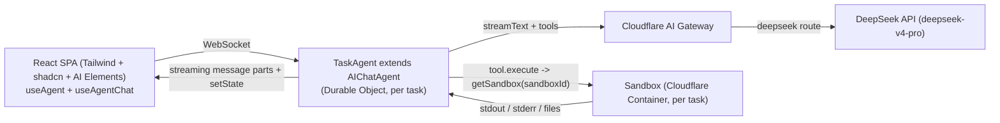

# Cloud Agent Platform — Implementation Plan (Final)

> Execution spec for a coding agent (e.g. Codex). Build a single-user "Cloud Agent Platform":
> a user submits a natural-language task; an autonomous agent runs in an isolated cloud sandbox,
> reasoning with an LLM and calling tools (shell, file I/O) in a loop until done, streaming every
> step live to a React UI, and returning a final report.
>
> Stack: **React + Cloudflare** (Workers, Durable Objects, Containers/Sandbox SDK, Agents SDK, AI Gateway),
> LLM = **DeepSeek** via the AI SDK.
>
> NOTE FOR THE IMPLEMENTER: SDK surfaces evolve. Prefer retrieval from official docs over memory:
> - Agents SDK / AIChatAgent: https://developers.cloudflare.com/agents/
> - Chat agents: https://developers.cloudflare.com/agents/communication-channels/chat/chat-agents/
> - State: https://developers.cloudflare.com/agents/runtime/lifecycle/state/
> - Sandbox SDK: https://developers.cloudflare.com/sandbox/
> - AI Gateway (DeepSeek): https://developers.cloudflare.com/ai-gateway/usage/providers/deepseek/
> - DeepSeek AI SDK provider: https://ai-sdk.dev/providers/ai-sdk-providers/deepseek
> - AI Elements: https://ai-sdk.dev/elements  ·  shadcn: https://ui.shadcn.com

---

## 1. Goal & scope

**v1 (this plan):**
- Single user, no auth.
- Submit a task in natural language → watch the agent loop live (reasoning + tool calls + outputs) → get a final markdown report.
- The agent runs **fully autonomously** (no human approval step).
- Real isolated execution: the agent runs shell commands, clones repos, and reads/writes files inside a Cloudflare Sandbox container.

**Out of scope (clean follow-ups):** multi-user/auth, global task history/dashboard, human-in-the-loop approval, preview URLs for services started in the sandbox.

---

## 2. Architecture



- **One Cloudflare Worker** hosts everything: the React SPA (static assets), the `TaskAgent` Durable Object, and the `Sandbox` container Durable Object.
- **`TaskAgent`** (an `AIChatAgent`) owns the autonomous loop. The AI SDK `streamText` multi-step tool loop *is* the agent loop.
- **`Sandbox`** is the isolated execution environment — one container per task, keyed by the task id.
- **DeepSeek** is reached through **AI Gateway** (observability, caching, rate limiting) using your own DeepSeek API key.

---

## 3. Why these building blocks

- **AIChatAgent** (`@cloudflare/ai-chat`) instead of a hand-rolled agent loop, because it gives us for free:
  - the AI SDK `streamText` multi-step tool loop (`stopWhen`, `prepareStep`),
  - `chatRecovery` so long runs survive Durable Object eviction mid-stream,
  - automatic SQLite message persistence + resumable streaming on reconnect,
  - tool calls as structured message parts (render directly as the timeline),
  - built-in cancellation (`stop()`) and multi-client sync.
- **Sandbox SDK** (`@cloudflare/sandbox`) for genuine isolated shell + filesystem execution (requires Workers Paid plan + Docker locally).
- **`@ai-sdk/deepseek`** dedicated provider (simpler than openai-compatible; native reasoning streaming, `thinking`/`reasoningEffort`, prompt-cache metrics), pointed at the AI Gateway `baseURL`.
- **`setState`** (generic Agent state) for a small task-metadata layer rendered as a status header, separate from the message stream.

---

## 4. Initialize via CLI (scaffold, then customize)

Do NOT hand-create the project. Start from the official Cloudflare Agents starter, which already
ships a working `AIChatAgent` + React + Vite + Tailwind app (streaming, reasoning display, tool
patterns, message persistence, dark/light mode) with `wrangler.jsonc`, `tsconfig.json` (extends
`agents/tsconfig`), and `vite.config.ts` (with the `agents/vite` decorator plugin) preconfigured.

```bash
# 1. Scaffold from the official starter (an AIChatAgent chat app)
npm create cloudflare@latest -- cloud-agent --template cloudflare/agents-starter
cd cloud-agent
npm install
npm run dev   # sanity check the starter runs (uses Workers AI by default)
```

Then layer our customizations on top:

```bash
# 2. Add our runtime deps (DeepSeek provider + Sandbox SDK)
npm i @cloudflare/sandbox @ai-sdk/deepseek
#    (agents, @cloudflare/ai-chat, ai, zod, react are already present from the starter)

# 3. UI: shadcn (Base UI) + AI Elements (replace the starter's Kumo UI)
npx shadcn@latest init        # choose Base UI primitives + Tailwind
npx ai-elements@latest        # vendors AI Elements into the client components dir
```

What we then change vs. the starter (details in later sections):
- swap the model from Workers AI → DeepSeek via AI Gateway (`@ai-sdk/deepseek`),
- add the **Sandbox** container (Dockerfile + wrangler container/DO/migration + re-export),
- replace the demo tools with `bash`/`read_file`/`write_file`/`list_files` backed by the sandbox,
- rename the agent class to `TaskAgent`, add the autonomous system prompt + `TaskState`,
- replace the chat UI with shadcn + AI Elements rendering the agent timeline.

Requirements: Node 18+, Docker running locally (for the Sandbox container), a Cloudflare account on
the **Workers Paid** plan (Containers), and a DeepSeek API key.

> The starter uses `src/server.ts`, `src/client.tsx`, `src/app.tsx`, `src/styles.css`. You may keep
> that flat layout (edit those files in place) or split into the structure in §5 — either is fine.
> Editing the starter files in place is the simplest path.

---

## 5. Project structure (optional target)

The starter already provides `wrangler.jsonc`, `tsconfig.json` (extends `agents/tsconfig`),
`vite.config.ts` (with `agents/vite`), `package.json`, `index.html`, and `src/{server.ts,client.tsx,app.tsx,styles.css}`.
You can keep that flat layout and just edit those files, or refactor to:

```
cloud-agent/
├─ wrangler.jsonc            # from starter; add: ai binding, Sandbox container/DO/migration, vars
├─ Dockerfile               # NEW (Sandbox image)
├─ .dev.vars                # NEW, local secrets (gitignored)
├─ tsconfig.json            # from starter (extends agents/tsconfig — handles decorators)
├─ vite.config.ts           # from starter (agents(), react(), cloudflare() plugins)
├─ worker-configuration.d.ts# generated by `wrangler types`
└─ src/
   ├─ server.ts             # TaskAgent + Worker entry + Sandbox re-export  (or split into server/*)
   ├─ tools.ts              # bash / read_file / write_file / list_files
   ├─ deepseek.ts           # DeepSeek provider via AI Gateway
   ├─ app.tsx               # chat UI (shadcn + AI Elements)
   ├─ client.tsx            # React entry
   └─ components/ai-elements/  # vendored by `npx ai-elements`
```

---

## 6. Configuration files (edit the starter's, don't recreate)

### `wrangler.jsonc` — apply these changes to the starter's file
Keep the starter's `name`, `main`, `compatibility_date`/`flags`, `assets`, and its existing chat-agent
DO binding (rename it to `TaskAgent`). Then **add**: the `ai` binding, the Sandbox container, the
Sandbox DO binding, the Sandbox migration class, and `vars`.

```jsonc
{
  // ...starter keeps: name, main, compatibility_date, compatibility_flags, assets...

  // ADD: Workers AI binding — used only for env.AI.gateway(id).getUrl("deepseek")
  "ai": { "binding": "AI" },

  // ADD: isolated execution container (Sandbox SDK)
  "containers": [
    { "class_name": "Sandbox", "image": "./Dockerfile", "instance_type": "standard", "max_instances": 5 }
  ],

  "durable_objects": {
    "bindings": [
      { "name": "TaskAgent", "class_name": "TaskAgent" },   // renamed from starter's ChatAgent
      { "name": "Sandbox",   "class_name": "Sandbox" }       // ADD
    ]
  },

  // ADD Sandbox to the sqlite migration classes (add a NEW migration tag if the starter already has v1)
  "migrations": [
    { "tag": "v1", "new_sqlite_classes": ["TaskAgent", "Sandbox"] }
  ],

  // ADD: gateway name ("default" is auto-created on first authenticated request)
  "vars": { "AI_GATEWAY_ID": "default" }
}
```

> Migration note: if the starter already defines a `v1` migration for its chat agent, do NOT edit it —
> add a new tag (e.g. `{ "tag": "v2", "new_sqlite_classes": ["Sandbox"] }`) and rename the agent class
> via a rename migration if needed.

### `Dockerfile` (NEW)

```dockerfile
FROM docker.io/cloudflare/sandbox:0.7.0
# git for repo-analysis tasks; add more tools as needed (keep lean for cold starts)
RUN apt-get update && apt-get install -y git && rm -rf /var/lib/apt/lists/*
EXPOSE 8080
```

### `.dev.vars` (gitignored)

```
DEEPSEEK_API_KEY=sk-...your-deepseek-key...
AI_GATEWAY_ID=default
```

In production set these with `npx wrangler secret put DEEPSEEK_API_KEY` (and keep `AI_GATEWAY_ID` in `vars`).

### `tsconfig.json` (from starter — leave as-is)
- The starter extends `agents/tsconfig`, which sets the correct decorator/module options. Do NOT
  hand-configure `experimentalDecorators`; decorator support comes from the `agents/vite` plugin.

### `vite.config.ts` (from starter — leave as-is)
- The starter already includes the required plugins:

```ts
import { cloudflare } from "@cloudflare/vite-plugin";
import react from "@vitejs/plugin-react";
import agents from "agents/vite"; // TC39 decorator transform for @callable() in Vite 8
import { defineConfig } from "vite";

export default defineConfig({ plugins: [agents(), react(), cloudflare()] });
```

- Run `npx wrangler types` after editing `wrangler.jsonc` to regenerate the `Env` interface.

---

## 7. Server implementation

### `src/server/deepseek.ts`

```ts
import { createDeepSeek } from "@ai-sdk/deepseek";

// Build a DeepSeek model routed through Cloudflare AI Gateway.
// env.AI.gateway(id).getUrl("deepseek") returns the gateway base URL for the
// deepseek provider (no hardcoded account id). Drop baseURL to call DeepSeek directly.
export async function getDeepSeekModel(env: Env) {
  const baseURL = await env.AI.gateway(env.AI_GATEWAY_ID).getUrl("deepseek");
  const deepseek = createDeepSeek({ apiKey: env.DEEPSEEK_API_KEY, baseURL });
  return deepseek("deepseek-v4-pro"); // model id may be passed as a string
}
```

### `src/server/tools.ts`

```ts
import { tool } from "ai";
import { z } from "zod";
import { getSandbox } from "@cloudflare/sandbox";

const MAX_OUTPUT = 12_000; // cap a single tool result so it can't blow the context
const truncate = (s: string) =>
  s.length > MAX_OUTPUT ? s.slice(0, MAX_OUTPUT) + "\n…[truncated]" : s;

// Factory: bind tools to a specific sandbox (one container per task).
export function makeTools(env: Env, sandboxId: string) {
  const sb = () => getSandbox(env.Sandbox, sandboxId);

  return {
    bash: tool({
      description:
        "Run a shell command in the isolated sandbox (Linux). Use for git clone, " +
        "grep/find, building, running scripts, etc. Returns stdout/stderr/exitCode.",
      inputSchema: z.object({ command: z.string() }),
      execute: async ({ command }) => {
        const r = await sb().exec(command);
        return {
          exitCode: r.exitCode,
          stdout: truncate(r.stdout ?? ""),
          stderr: truncate(r.stderr ?? ""),
        };
      },
    }),

    read_file: tool({
      description: "Read a file from the sandbox filesystem.",
      inputSchema: z.object({ path: z.string() }),
      execute: async ({ path }) => ({ content: truncate(await sb().readFile(path)) }),
    }),

    write_file: tool({
      description: "Write (create/overwrite) a file in the sandbox filesystem.",
      inputSchema: z.object({ path: z.string(), content: z.string() }),
      execute: async ({ path, content }) => {
        await sb().writeFile(path, content);
        return { ok: true, path };
      },
    }),

    list_files: tool({
      description: "List files in a sandbox directory.",
      inputSchema: z.object({ path: z.string().default("/workspace") }),
      execute: async ({ path }) => ({ files: await sb().listFiles(path) }),
    }),
  };
}
```

### `src/server/agent.ts`

```ts
import { AIChatAgent } from "@cloudflare/ai-chat";
import { streamText, convertToModelMessages, pruneMessages, stepCountIs } from "ai";
import type { Connection } from "agents";
import { getDeepSeekModel } from "./deepseek";
import { makeTools } from "./tools";

export type TaskState = {
  status: "idle" | "running" | "done" | "error";
  title: string;
  sandboxId: string;
  createdAt: string; // ISO string (state must be serializable)
  error: string | null;
};

const SYSTEM_PROMPT = [
  "You are an autonomous software agent running inside an isolated Linux sandbox.",
  "You complete the user's task by reasoning and calling tools in a loop:",
  "- Use `bash` for shell commands (git clone, grep/find, build, run, etc.).",
  "- Use `read_file`/`write_file`/`list_files` for file I/O.",
  "Work iteratively: inspect, act, observe, repeat. Do not ask the user questions —",
  "make reasonable assumptions and proceed. When finished, output a clear, structured",
  "Markdown report summarizing what you did and the results.",
].join("\n");

export class TaskAgent extends AIChatAgent<Env, TaskState> {
  // Survive Durable Object eviction during long autonomous runs.
  chatRecovery = true;

  initialState: TaskState = {
    status: "idle",
    title: "",
    sandboxId: "",
    createdAt: "",
    error: null,
  };

  // Only the server may change task status (reject client-pushed state).
  validateStateChange(_next: TaskState, source: Connection | "server") {
    if (source !== "server") throw new Error("Task state is server-controlled");
  }

  async onChatMessage(_onFinish: unknown, options?: { abortSignal?: AbortSignal }) {
    const sandboxId = this.name; // one sandbox per task instance

    // First turn: seed task metadata.
    if (this.state.status === "idle") {
      const firstText =
        this.messages[0]?.parts?.find((p: any) => p.type === "text")?.text ?? "Task";
      this.setState({
        ...this.state,
        status: "running",
        title: firstText.slice(0, 80),
        sandboxId,
        createdAt: new Date().toISOString(),
      });
    } else {
      this.setState({ ...this.state, status: "running", error: null });
    }

    const model = await getDeepSeekModel(this.env);

    const result = streamText({
      model,
      system: SYSTEM_PROMPT,
      // Prune old tool I/O from the LLM context (sandbox outputs are large).
      // Storage of full history is handled separately by SQLite + auto-compaction.
      messages: pruneMessages({
        messages: await convertToModelMessages(this.messages),
        toolCalls: "before-last-2-messages",
      }),
      tools: makeTools(this.env, sandboxId),
      stopWhen: stepCountIs(25), // bound runaway loops
      abortSignal: options?.abortSignal, // wire the stop button through
    });

    return result.toUIMessageStreamResponse();
  }

  // Fired after a turn finishes; flip status based on outcome.
  async onChatResponse(res: { status: string; error?: string }) {
    if (res.status === "completed") {
      this.setState({ ...this.state, status: "done", error: null });
    } else if (res.status === "error") {
      this.setState({ ...this.state, status: "error", error: res.error ?? "unknown error" });
    }
  }
}
```

> The implementer should confirm exact `onChatResponse` / `onChatMessage` signatures against the
> chat-agents reference and adjust types accordingly.

### Worker entry (`src/server.ts`, or `src/server/index.ts` if split)
The starter already has a `routeAgentRequest`-based default export. Just ensure these two re-exports
exist alongside it (and that the agent class is `TaskAgent`):

```ts
import { routeAgentRequest } from "agents";

export { Sandbox } from "@cloudflare/sandbox"; // REQUIRED re-export for the container DO
export { TaskAgent } from "./agent";           // (or define TaskAgent in this same file)

export default {
  async fetch(request: Request, env: Env): Promise<Response> {
    return (
      (await routeAgentRequest(request, env)) ||
      new Response("Not found", { status: 404 })
    );
  },
} satisfies ExportedHandler<Env>;
```

---

## 8. Client implementation

- Bootstrap React (`main.tsx` → `App.tsx`), Tailwind (`index.css`), shadcn (Base UI), and AI Elements.
- Generate a `taskId` (uuid) per task; persist recent ids in `localStorage` so the user can reopen a run. A "New task" button creates a fresh `taskId` (or calls `clearHistory`).

### `App.tsx` (shape)

```tsx
import { useState } from "react";
import { useAgent } from "agents/react";
import { useAgentChat } from "@cloudflare/ai-chat/react";
// AI Elements (vendored): Conversation, Message, Response, Reasoning, Tool, PromptInput, Loader
import { /* ... */ } from "./components/ai-elements";
import { StatusBadge } from "./components/StatusBadge";

export default function App() {
  const [taskId] = useState(() => crypto.randomUUID());
  const [taskState, setTaskState] = useState<any>(null);

  const agent = useAgent({
    agent: "TaskAgent",
    name: taskId,
    onStateUpdate: (s: any) => setTaskState(s), // TaskState header data
  });

  const { messages, sendMessage, status, stop, clearHistory } = useAgentChat({ agent });

  return (
    <div className="mx-auto max-w-3xl p-4">
      <StatusBadge state={taskState} />

      {/* Timeline */}
      {/* For each message, for each part:
          - part.type === "text"      -> <Response>{part.text}</Response>  (markdown)
          - part.type === "reasoning" -> <Reasoning>{part.text}</Reasoning>
          - tool parts (type starts "tool-") -> <Tool> with ToolHeader/ToolInput/ToolOutput,
              switch on part.state:
                "input-available"  -> show args + <Loader/> (running)
                "output-available" -> show args + stdout/stderr (part.output)
                "output-error"     -> show error
      */}

      {/* PromptInput -> sendMessage({ text }); disable while status === "streaming";
          show Stop (stop()) while streaming */}
    </div>
  );
}
```

- `StatusBadge` renders `state.status` (`idle`/`running`/`done`/`error`), `state.title`, and elapsed time from `state.createdAt`.
- Keep the UI clean and modern (good spacing, monospace for tool output, collapsible tool cards).

---

## 9. Storage / state design

No custom SQL schema in v1 — storage is layered and mostly SDK-managed.

- **Per-task isolation, no central DB:** one task = one `TaskAgent` DO (its own embedded SQLite) + one `Sandbox` container (its own ephemeral filesystem). Both keyed by `taskId`.
- **`TaskAgent` SQLite (durable, SDK-managed):**
  - **messages** — full `UIMessage[]` (reasoning + every tool call's args/output); this is the durable timeline; auto-compacted near the 2 MB row limit.
  - **stream buffer** — chunks for resumable streaming.
  - **fiber / recovery rows** — from `chatRecovery` (`runFiber`/`stash`).
  - **agent state** — our `TaskState` JSON blob via `setState` (not a hand-made table).
- **Sandbox filesystem (ephemeral):** `/workspace`, cloned repos, written files. NOT durable — the container sleeps after ~10 min idle and is wiped on `destroy()`. Anything worth keeping flows back as **messages**.
- **Best practices followed:** keep `setState` small (it broadcasts on every change); large outputs live in messages, never in state; serializable values only.
- **Implication:** no built-in "list all tasks" view; client tracks `taskId`s in `localStorage`. A global history dashboard (D1 table or a registry DO recording `{ taskId, title, status, createdAt }`) is a clean follow-up.

---

## 10. Build, run, deploy

The starter already provides `dev` / `build` / `deploy` scripts. After scaffolding (§4) and customizing:

```bash
# 0. Ensure Docker is running (required for the Sandbox container locally)
# 1. Add local secrets to .dev.vars (DEEPSEEK_API_KEY, AI_GATEWAY_ID)
# 2. Regenerate Env types after wrangler.jsonc edits
npx wrangler types

# 3. Dev (runs Worker + DOs + container)
npm run dev

# 4. Deploy
npx wrangler secret put DEEPSEEK_API_KEY
npm run deploy
```

---

## 11. Validation

1. `npm run dev`, open the app.
2. Submit: **"Clone https://github.com/<small-public-repo>, find all TODO comments, and generate a Markdown report grouping them by file."**
3. Expect: live timeline streaming `bash`/`read_file`/`list_files` tool calls with stdout, status badge `running → done`, and a final Markdown report.
4. Refresh the page mid-run → the run is still there and resumes (persistence + resumable streaming).
5. Click Stop mid-run → the DeepSeek call is cancelled (status reflects it).

**Acceptance criteria**
- Task runs autonomously to completion with no approval prompts.
- All tool execution happens inside the sandbox (verify with a `bash` like `uname -a` / `pwd`).
- Reasoning, tool calls (args + output), and final report all render in the timeline.
- DeepSeek traffic appears in the AI Gateway dashboard.

---

## 12. Key correctness notes for the implementer

- Re-export **both** `Sandbox` and `TaskAgent` from the Worker entry, and register **both** in `durable_objects` + `migrations` (`new_sqlite_classes`).
- Keep the starter's decorator setup: `agents/vite` plugin + `tsconfig` extending `agents/tsconfig`. Do **not** hand-set `experimentalDecorators`.
- Build the DeepSeek model **inside** `onChatMessage` (needs `env`; `getUrl` is async).
- `pruneMessages` + per-tool output truncation are both required to keep long multi-step runs within context/cost.
- Always forward `options.abortSignal` into `streamText`.
- Containers + Sandbox require the Workers Paid plan and Docker for local dev.
- Verify exact AIChatAgent hook signatures (`onChatMessage`, `onChatResponse`, recovery options) against the current chat-agents docs before finalizing types.
