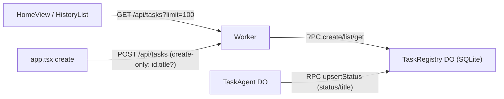

## Background

Today the "history" is fake: it lives only in the browser via [src/lib/storage.ts](src/lib/storage.ts) (`localStorage`, capped at 20), read by [src/components/home/history-list.tsx](src/components/home/history-list.tsx) and written by [src/app.tsx](src/app.tsx) + [src/components/task/task-view.tsx](src/components/task/task-view.tsx). The real source of truth (each `TaskAgent` Durable Object) is never indexed anywhere, so the list is lost across browsers/devices.

This is a single-user app, so one global registry instance (`idFromName("default")`) is enough; no auth/per-user partitioning needed.

## New data flow

Writer split (resolves P1 status-regression): the client may only **create** a row (seed `id` + optional `title`); the `TaskAgent` is the only writer of `status`/`title`/`updatedAt` after creation. The API never accepts a client-supplied `status`.

## 1. TaskRegistry Durable Object — [src/server.ts](src/server.ts)

Add a plain `DurableObject` (from `cloudflare:workers`) with a SQLite table and export it:

- Table `tasks(id TEXT PRIMARY KEY, title TEXT, status TEXT, createdAt TEXT, updatedAt TEXT)`, created in the constructor via `this.ctx.storage.sql.exec(...)`.
- RPC methods (two distinct writers, so no full client upsert):
  - `create({ id, title })` — `INSERT ... ON CONFLICT(id) DO NOTHING`; server stamps `status = "idle"`, `createdAt = updatedAt = now`. Idempotent and never regresses an existing row.
  - `upsertStatus({ id, title, status })` — used only by the agent. The INSERT branch (agent fires before any client `create`) self-stamps `createdAt = updatedAt = now`; the ON CONFLICT branch preserves `createdAt` and sets `updatedAt = now`. To avoid blanking a client-seeded title with an empty agent title, the title clause is `title = CASE WHEN excluded.title != '' THEN excluded.title ELSE tasks.title END` (and `reportToRegistry` also guards against sending an empty title).
  - `list(limit = 100)` — `SELECT ... ORDER BY updatedAt DESC LIMIT ?` (caps at 100, resolves P3).
  - `get(id)` — single-row lookup (resolves P2 client `getTask`).
- Helper `getRegistry(env)` → `env.TaskRegistry.get(env.TaskRegistry.idFromName("default"))`.

## 2. TaskAgent reports to the registry — [src/server.ts](src/server.ts)

The agent owns all post-creation status/title updates, and reporting must be awaited (resolves P1 fire-and-forget):

- Add `private async reportToRegistry(state: TaskState)` that takes an explicit state object and calls `await getRegistry(this.env).upsertStatus({ id: this.name, title: state.title, status: state.status })`.
- Pattern at each transition: build `nextState`, call `this.setState(nextState)`, then report **that exact object** (never re-read `this.state` after `setState`).
  - Initial `running`: `await this.reportToRegistry(runningState)` before returning the stream.
  - In `toUIMessageStreamResponse({ onFinish, onError })`: build the done/idle/error state, `setState`, then report. Make the callbacks `async` and `await` the report; additionally wrap with `this.ctx.waitUntil(...)` so the DO stays alive until the write lands even if the stream consumer detaches.
- Verification step during build: confirm the installed `@cloudflare/ai-chat` `toUIMessageStreamResponse` awaits an async `onFinish`. If it does not, rely on the `this.ctx.waitUntil(...)` guard as the durable path.

## 3. Worker API + routing — [src/server.ts](src/server.ts) & [wrangler.jsonc](wrangler.jsonc)

- In the default `fetch`, before `routeAgentRequest`, handle:
  - `GET /api/tasks?limit=100` → `Response.json(await getRegistry(env).list(limit))` (clamp limit to a max of 100).
  - `GET /api/tasks/:id` → `getRegistry(env).get(id)`, 404 JSON if absent.
  - `POST /api/tasks` (create-only) → validate body with zod `z.object({ id: z.string().min(1), title: z.string().max(200).optional() })` (resolves P2); on failure return 400. Then `await getRegistry(env).create(body)` and return the created row.
- [wrangler.jsonc](wrangler.jsonc):
  - Add `"/api/*"` to `assets.run_worker_first` (alongside `/agents/*`, `/oauth/*`) so the SPA fallback does not swallow the API.
  - Add a `TaskRegistry` binding under `durable_objects.bindings`.
  - Add `"TaskRegistry"` to `migrations` (`new_sqlite_classes`), as a new migration tag (e.g. `v2`).
- Run `npm run types` to regenerate [env.d.ts](env.d.ts) with the new binding.

## 4. Client storage becomes an API client — [src/lib/storage.ts](src/lib/storage.ts)

Keep `TaskMeta`/`TaskStatus` types and `formatRelativeTime`, but replace the `localStorage` internals with `fetch`:

- `getTasks(): Promise<TaskMeta[]>` → `fetch("/api/tasks?limit=100")`.
- `createTask(input: { id: string; title?: string }): Promise<TaskMeta>` → `POST /api/tasks` (create-only; replaces the old full `upsertTask`).
- `getTask(id): Promise<TaskMeta | undefined>` → `fetch("/api/tasks/" + id)` (uses the new single-row endpoint, not list-and-find).
- Drop `updateTask` (status/title now flow from the agent server-side) and the localStorage migration helpers.

## 5. Wire async reads/writes in the UI

- [src/components/home/history-list.tsx](src/components/home/history-list.tsx): load via `useEffect` + `useState`, re-fetch when `refreshKey` changes, show a simple loading/empty state. `HistoryItem` stays as-is.
- [src/app.tsx](src/app.tsx): `handleHomeSubmit` / `handleNewTask` call `createTask({ id, title })` (POST) then open the task; `bumpRefresh` still drives the home re-fetch on return.
- [src/components/task/task-view.tsx](src/components/task/task-view.tsx): remove the `updateTask` write in `onStateUpdate` (server is authoritative); fetch `meta` for the header via `getTask(taskId)` in an effect (initial fallback only). For live status, give [src/components/task/task-header.tsx](src/components/task/task-header.tsx) a `status?: TaskStatus` prop and pass `taskState?.status ?? meta?.status` from `TaskView`; the badge (currently `{meta.status}` at line 44, only shown when `meta` exists) renders from that prop instead, so it follows `done`/`error` live without polling.

## Notes / decisions

- `list()` caps at `LIMIT 100`; pagination deferred until there's real demand.
- Single source of truth split: client creates rows, agent owns status/title — no full client upsert, so stale data can't regress `done`/`error`/`running`.
- No delete/rename per request; registry rows persist.
- Existing `localStorage` history is not migrated (it was per-browser and disposable); the new list rebuilds from server records as tasks run.
